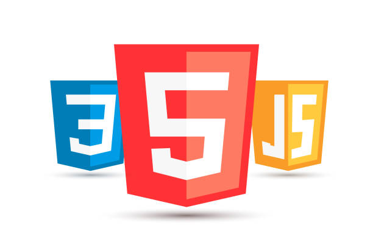

# Lenguaje De Marcas Y Sistemas De Gestion De La Informacion - 1DAM
En es este repositorio puedes encontrar todas las actividades que he ido haciendo a lo largo de este curso en el módulo de Lenguaje de Marcas y Sistemas de Gestión De La Información en 1DAM.
 

## Temas:
### [1. Introducción](./Unidad-1/readme.md)
### [2. HTML](./Unidad-2/readme.md)
### [3. CSS](./Unidad-3/readme.md)
### [4. JavaScript](./Unidad-4/readme.md)

 

## Contacto
* **Contacto:** daniel.rodriguezfernandez@alumno.iesluisvives.org
* **Twiter:** [@idanirf](https://twitter.com/idanirf)
* **Linkedin:** [Visita mi perfil](https://www.linkedin.com/in/danielrodriguezfernandez03002/)

