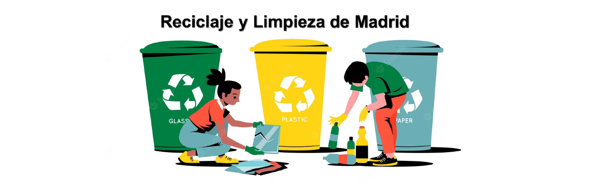
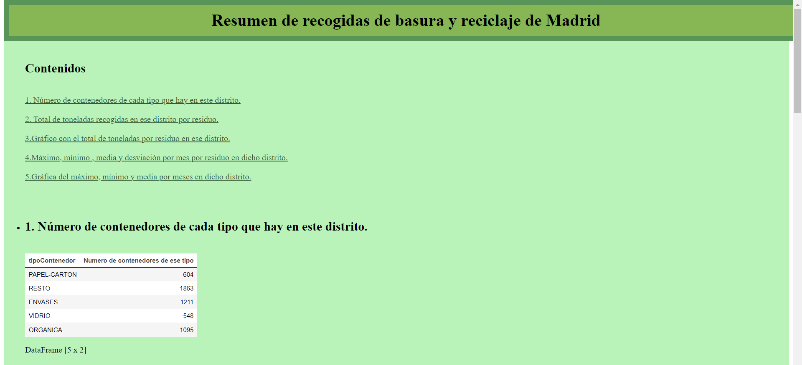
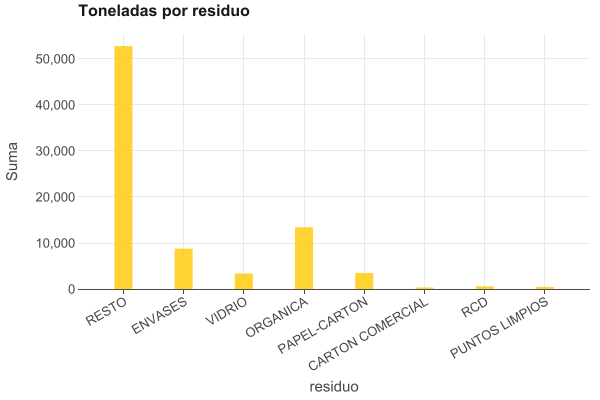
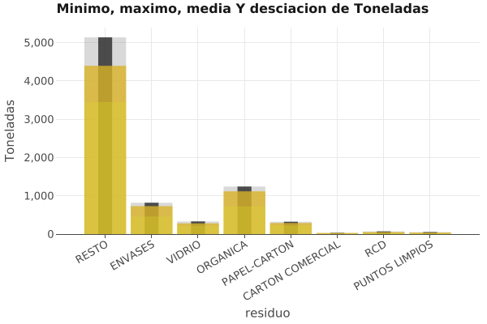

# Reciclaje y Limpieza de Madrid

## Descripción
Se nos ha contratado para realizar un analisis de la recogida de residuos en el municipio de Madrid. Tenemos dos archivos de datos, en uno de ellos tenemos la información sobre los contenedores y el tipo de contenedor y residuo que almacena y en el otro tenemos la información sobre las recogidas de residuos. Estos archivos contienen todos los datos de recogidas durante el año 2021.

 En el analisis de datos mostramos un documento sobre la recogida de residuos y sus datos estadísticos, además de unas gráficas basadas en estos datos.

## Funcionamiento
Para que funcione el programa debemeos ejecutar el siguiente comando en la terminal:

**java -jar basuras.jar opcion(parse/resumen) paramentros[***distrito*** directorio_origen  directorio_destino]**

***En la opción resumen puedes añadir un parámetro más que sera el nombre del distrito y podrás sacar un resumen solo de ese distrito.***

## Analisis de datos

## Autores
- Azahara Blanco Rodríguez
- Daniel Rodríguez Fernández

## Contacto 
* daniel.rodriguezfernandez@alumno.iesluisvives.org
* azahara.blanco@alumno.iesluisvives.org

