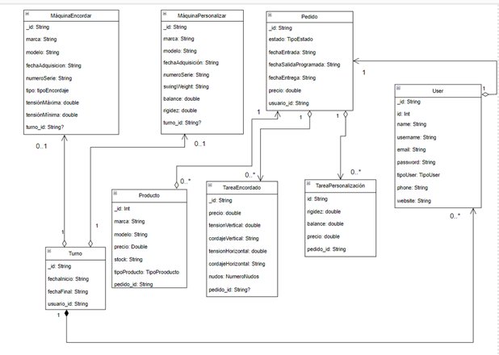

# TennisLab Barcelona

## Introducción
Se ha planteado un nuevo problema en el módulo de acceso a datos de segundo de desarrollo de aplicaciones multiplataforma. En general hay que crear una solución para una tienda de material de tenis, esta solución nos debe permitir gestionar la personalización de material de los clientes, adquisición de nuevo material, gestionar los usuarios, gestionar los turnos de nuestros empleados así como las tareas que tienen asignadas.
Para resolver este problema vamos a implementar nuevas tecnologías que no habíamos implementado en la anterior práctica, como por ejemplo el uso de base de datos no relacionales, implementación de API’s, cachear los datos almacenados.

## Descripción del problema propuesto
Nos hemos reunido con el cliente donde nos ha entregado un documento con todas las especificaciones que debe cumplir este programa, así como con el jefe de la empresa quien nos ha indicado el uso de las nuevas tecnologías que debemos implementar para resolver dicho proyecto, a continuación dejamos el documento de partida para el desarrollo de este software:
En nuestra aplicación se conectan distintos usuarios. Pero debemos tener en cuenta que este servicio lo tenemos externalizado, por lo que debemos hacer uso de una API REST para operar con todo lo relacionado con él desde el endpoint: https://jsonplaceholder.typicode.com/users, estando este servicio cacheado y sincronizado en nuestro sistema para las operaciones CRUD y que la cache se refresca cada 60 segundos de manera automática.
Trabajamos con varias máquinas, que son de encordar o de personalización, como ya sabemos.
Los pedidos pueden estar formados por varias tareas o partes de trabajo a realizar que recibimos de un tenista y son asignados a un encordador y tienen un estado. Tenemos un tope de entrega marcado por una fecha. Los pedidos tienen una fecha de entrada, una fecha de salida programada y de salida final y un precio asociado que es la suma de todas las acciones. La fecha de salida final será inicialmente la programada, luego se actualizará a la real tal y como vimos en la práctica anterior. Debemos tener en cuenta restricciones:
Para cada tarea del pedido o acción a realizar a parte de almacenarla en nuestra base de datos la vamos a almacenar remotamente en un histórico en la nube al que podremos acceder mediante el endpoint: https://jsonplaceholder.typicode.com/todos. Necesitamos saber la raqueta o raquetas (una acción por raqueta) con la que trabajar si se necesita. Teniendo en cuenta todas las tareas posibles, precios y restricciones de la práctica anterior.
Debemos tener en cuenta que un encordador no puede tener más de dos pedidos activos por turno. Del turno nos interesa saber comienzo y fin del mismo. Un encordador no puede usar otra máquina si ya tiene asignada una en un turno determinado.
Además, como vendemos distintos productos del tipo: raquetas, cordajes, y complementos como overgrips, grips, antivibradores, fundas, etc. Necesitamos saber el tipo, marca, modelo, precio y stock del mismo. Ten en cuenta que solo podrá realizar operaciones CRUD el encargado del sistema, pero la asignación de pedidos la pueden hacer también los encordadores.
Por otro lado, nos interesa mantener el histórico de los elementos del sistema y:
-	Sistema de gestión de usuarios local y remoto sincronizados.
-	CRUD completo de los elementos que consideres necesarios.
-	Sistema de errores y excepciones personalizados.
-	Información completa en JSON de un pedido.
-	Listado de pedidos pendientes en JSON.
-	Listado de pedidos completados en JSON.
-	Listado de productos y servicios que ofrecemos en JSON.
-	Listado de asignaciones para los encordadores por fecha en JSON.
-	Gestión de tareas locales y remoto, histórico remoto.

1.	Completar la información que te falta hasta tener los requisitos de información completos.
2.	Realizar el Diagrama de Clases asociado, mostrando la semántica, navegabilidad y cardinalidad de las relaciones, justificando la respuesta con el máximo detalle. Obtener las colecciones existentes y aplicar patrones de diseño NoSQL razonando en cada punto la decisión adoptada y posibles mejoras en la resolución.
3.	Implementación y test de repositorios, servicios y controladores reactivos de las operaciones CRUD y otras operaciones relevantes aplicando las restricciones indicadas usando solo MongoDB y un framework de inyección de dependencias. Elegir una colección en cada implementación y escuchar sus cambios en tiempo real.
4.	Implementación y test de repositorios, servicios y controladores reactivos de las operaciones CRUD y otras operaciones relevantes aplicando las restricciones indicadas usando Spring Data MongoDB usando el sistema propio de inyección de dependencias que tiene Spring Data. Elegir una colección en cada implementación y escuchar sus cambios en tiempo real.
5.	En las dos posibles implementaciones Se deben tipificar los resultados tanto correctos como incorrectos, como operaciones válidas o inválidas con el sistema que creas más acertado y mostrar as salidas en JSON de manera correcta con los DTOs adecuados.
6.	Nuestro programa debe llamarse con un JAR de la siguiente manera: java -jar tennislab.jar.
Se debe entregar:
•	Repositorio GitHub Personal y el de entrega con la solución en el que incluyas:
•	Readme explicando el proyecto y el nombre de los integrantes. Usa Markdown y mejora su estilo. Si no perderás puntos por la presentación.
•	Código fuente comentado y perfectamente estructurado con JDoc/KDoc. Además de los gitignore adecuados y que siga el flujo de trabajo GitFlow.
•	No se deben incluir los ejecutables si no se deben poder crear los jar desde el propio proyecto. Asegúrate que se puede crear y que los ficheros de configuración de la base de datos, así como datos de ejemplo están en directorios que se pueden ejecutar o se pueden leer desde resources.
•	Documentación en PDF donde expliques el diseño y propuesta de solución, así como clases y elementos usados haciendo especial énfasis en:
•	Requisitos de Información.
•	Diagrama de clases y justificación de este.
•	Alternativas y justificación detallada del modelo NoSQL. Arquitectura del sistema y patrones usados.
•	Explicación de forma de acceso a los datos.
•	La no entrega de este fichero invalidará la práctica.
•	La aplicación no debe fallar y debe reaccionar antes posibles fallos asegurando la consistencia y calidad de esta.
•	Enlace en el readme al vídeo en YouTube donde se explique las partes más relevantes de la practica y se muestre su ejecución. La duración del vídeo debe ser unos 30 minutos. La no entrega de este vídeo y donde se vea su ejecución anulará el resultado de la práctica.
•	Repositorio oficial de la entrega Enlace de entrega: https://classroom.github.com/a/GSctLb_o. La subirán los dos miembros del equipo, si no está en este repositorio se invalidará la práctica no pudiéndose entregar por otros medios.

## Diagrama de clases

### Justificación del diagrama de clases
A continuación explicamos la implementación del diagrama de clase que hemos desarrollado a partir de las indicaciones y requisitos del cliente.
Primero de todo vamos a identificar todas las clases que hemos implementado:
o	User
o	Turno
o	TareaEncordado
o	TareaPersonalizacion
o	MaquinaEncordar
o	MaquinaPersonalizar
o	Pedido
o	Producto
Entre estas clases se han creado relaciones para formar la arquitectura del software, más adelante explicaremos cada relación que se produce en el diagrama de clase.
Una de las primeras justificaciones que queremos dar es que hemos roto todas las herencias que se podían producir en el modelo de esta forma nos ha parecido más rápido a la hora de gestionar las relaciones entre las clases. Tecnológicamente también aportamos una explicación de esta forma a la hora por ejemplo de realizar una consulta la hacemos directamente sobre la clase a la hora de buscar será más rápido de la otra forma tendríamos que buscar la clase no heredada y de ahí saber qué tipo es en que hereda y ejecutar la consulta por lo tanto el tiempo sería mayor. Es verdad que utilizamos una NoSQL y por lo tanto podríamos embeber los datos o referenciar para hacer la herencia pero sí lo cambiamos a una SQL habría que hacer un mayor número de cambios en el modelo y en la implementación del software.
Vamos a comentar cada una de las clases y qué relación tiene con cada una de las clases del modelo.
•	Users: esta clase hace referencia a los usuarios registrados de nuestro sistema, de cada usuario recogeremos algunos datos como puede ser su contraseña que estará encriptada con bcrypt o el tipo de usuario que es que le dará más o menos privilegios de realizar operaciones en el sistema.
Para obtener los usuarios lo hemos hecho de forma diferente para obtener y operar con nuestros usuarios hemos tenido que implementar una API Rest en concreto la del siguiente endpoint “https://jsonplaceholder.typicode.com/todos”, a través de este endpoint haremos las operaciones GET, POST, DELETE… sobre los usuarios.
Tenemos que tener en cuenta que la clase usuarios es prescindible para poder operar con el resto de clases.
•	Turno: con la clase turno registramos cada vez que un usuario que es de tipo empleado ha comenzado una nuevo turno, registrado su hora de inicio y su hora de fin hay que tener en cuenta que esta clase tiene una relación con Users de forma referenciada, ya que cada vez que registramos un turno a ese turno le asignamos el id del usuario que registra ese turno.
•	Pedido: los pedido registran las solicitudes que realizan los usuarios, hay que destacar que los pedidos están relacionados con las tareas y los usuarios, primero explicamos la relación que tiene con los usuarios. 
Un pedido esta realizado por un usuario por lo tanto a ese pedido se le asigna el usuario que lo realiza, para hacer esta asignación lo hacemos por referencia al pedido le asignamos el id del usuario que realiza el pedido.
Ahora explicamos la relación que tiene los pedidos con las tareas de personalización y de encordar. Un pedido esta formado por tareas, puede tener una o varias tareas pero nunca podrá ser null.
•	TareaEncordado: es una clase que hace la composición al pedido, contiene su id, y el resto de los campos propios de la clase, además tiene un campo que es el número de pedido nunca puede ser null, una tarea siempre tiene que estar asociada a un pedido, lo hacemos de forma referenciada.
•	TareaPersonalizacion: es otra clase que hace la composición del pedido, contiene su id, y el resto de campos que son propios de la clase, además tiene un campo que hace referencia el número de pedido que nunca podrá ser null, es decir que una tarea siempre tiene que estar asociada a un pedido, lo hacemos de forma referenciada a la clase pedido, de esta forma es mucho más rápido ya que no es necesario embeber todo solo aquello que es necesario.
•	MaquinaEncordado: es una clase que utilizamos para registrar todas las maquinas de encordado existentes, hay que decir que comparte campos con las máquinas de personalización pero ya que hemos decidido que no exista herencia entre clases, cada clase de maquina tendrá sus propios campos.
Además cada maquina de encordado tendrá asociado un turno de esta forma podemos filtrar y limitar el numero de maquinas que puede utilizar un usuario en cada turno.
•	MaquinaPersonalizacion: es una clase que utilizamos para registrar todas las máquinas de personalización existentes, hay que decir que comparte campos con las máquinas de encordado pero ya que hemos decidido que no exista herencia entre clases, cada clase de maquina tendrá sus propios campos.
Además cada máquina de encordado tendrá asociado un turno de esta forma podemos filtrar y limitar el número de máquinas que puede utilizar un usuario en cada turno.
•	Producto: son productos o servicios que podemos ofrecer y pueden obtener los clientes, tiene atributos uno de ellos es el stock que es la cantidad de elementos existentes de ese producto.
Tiene una relación con los pedido, la relación se hace de forma referenciada, para asignar un producto a un pedido hay que introducir el número de pedido que tenía asignado.

## Funcionamiento
Una vez ejecutamos el programa podemos ver una demostración de su funcionamiento, en la que se puede ver como se crean los usuarios, los pedidos, las tareas, las máquinas, los turnos y los productos.

## Enlace al video
https://drive.google.com/file/d/11kEtOw8td_OvHaytYbTURfuc3B8FSk4-/view?usp=sharing

## Autores
- Jorge Sánchez Berrocoso
- Daniel Rodríguez Fernández
- Alfredo Maldonado Pertuz

## Contacto 
* daniel.rodriguezfernandez@alumno.iesluisvives.org
* jorge.sanchezberrocoso@alumno.iesluisvives.org
* alfredo.maldonado@alumno.iesluisvives.org