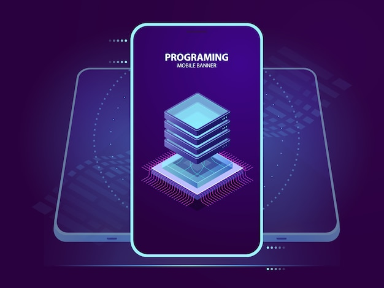

# Programación Multimedia y Dispositivos Móviles 2DAM
En es este repositorio puedes encontrar todas las actividades que he ido haciendo a lo largo de este curso en el módulo de Programación Multimedia y Dispositivos Móviles 2DAM.
 

## Temas:
### [1. Análisis de tecnologías para aplicaciones en dispositivos móviles](/Unidad-1)
### [2. Programación de aplicaciones para dispositivos móviles](/Unidad-2)
### [3. Utilización de librerías integradas](/Unidad-3/)
### [4.Desarrollo de juegos](/Unidad-4/)

 

## Contacto
* **Contacto:** daniel.rodriguezfernandez@alumno.iesluisvives.org
* **Twiter:** [@idanirf](https://twitter.com/idanirf)
* **Linkedin:** [Visita mi perfil](https://www.linkedin.com/in/danielrodriguezfernandez03002/)

