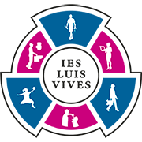

# ReservatyVives

## Introducción
Somos Dani y Azahara estudiantes de 2º del Grado Superior de Desarrollo de Aplicaciones Multiplataforma en el IES Luis Vives de Leganés, centro de excelencia desde el curso 2022/2023.

Hemos desarrollado esta aplicación para el proyecto final del módulo de Programación Multimedia y Dispositivos Móviles.

## ¿Qué es y cómo surge ReservatyVives?

ReservatyVives es una aplicación que surge en base a una necesidad, el IES Luis Vives de Leganés no tiene una aplicación para reservar espacios, y en este último año está creciendo, tenemos nuevas instalaciones como por ejemplo pistas de tenis, nuevas aulas, areas de desarrollo e innovación. Por ello, hemos desarrollado esta aplicación para que la comunidad educativa que forma el IES Luis Vives pueda reservar espacios en el instituto.

ReservatyVives permite a los usuarios reservar espacios en el instituto. El usuario puede elegir el espacio, la fecha y la hora de la reserva. Además, el usuario puede crear nuevos espacios y consultar las reservas realizadas.

## ¿Cómo funciona?
La aplicación se divide en dos partes: la parte del usuario y la parte del administrador.

### Parte del usuario
La parte del usuario permite consultar todos los espacios disponibles y realizar una reserva.

### Parte del administrador
La parte del administrador permite crear nuevos espacios y consultar las reservas realizadas.

## Tecnologías utilizadas
* [Android Studio](https://developer.android.com/studio)
* [Firebase](https://firebase.google.com/)
* [Kotlin](https://www.kotlinlang.org/)
* [XML](https://www.w3schools.com/xml/)

## Contacto

* **Contacto:** daniel.rodriguezfernandez@alumno.iesluisvives.org
* **Twiter:** [@idanirf](https://twitter.com/idanirf)
* **Linkedin:** [Visita mi perfil](https://www.linkedin.com/in/danielrodriguezfernandez03002/)

    

